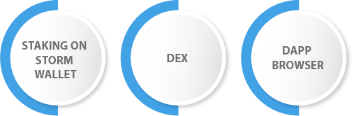

# 🚙 UTILITIES

<figure><figcaption></figcaption></figure>

## <mark style="color:blue;">Staking on Storm Wallet</mark>

Coin marking permits crypto clients the capacity to cast a ballot and produce a pay with the coins and tokens they hold. One of the principal advantages of marking coins is that it eliminates the requirement for computerized resources for continually consume energy and cycle through costly equipment.

Storm Wallet takes no exchange expenses from you marking, so you can keep every one of your prizes.

Marking gives clients ensured returns and an anticipated kind of revenue. You can procure yearly rate yields (APY).

Marked coins don't deteriorate and are just impacted by market cost unpredictability - really procuring crypto while you rest.

## <mark style="color:blue;">DEX</mark>

With the implicit decentralized trade (DEX), you can trade coins cross-chain or exchange, which is extremely helpful as you will actually want to exchange any place you go with your telephone. Very few applications give the entrance and security of Tempest Wallet in a hurry.

## <mark style="color:blue;">dApp Browser</mark>

The decentralized application (dApp) program is home to a whole biological system of content. With the underlying dApp program, you can find numerous other DEX's or DeFi Yield Ranches on the different blockchain organizations and track down gaming, utility, social, and even commercial centers dApp.The Program is only a tick a-way from the whole universe of DeFi.
